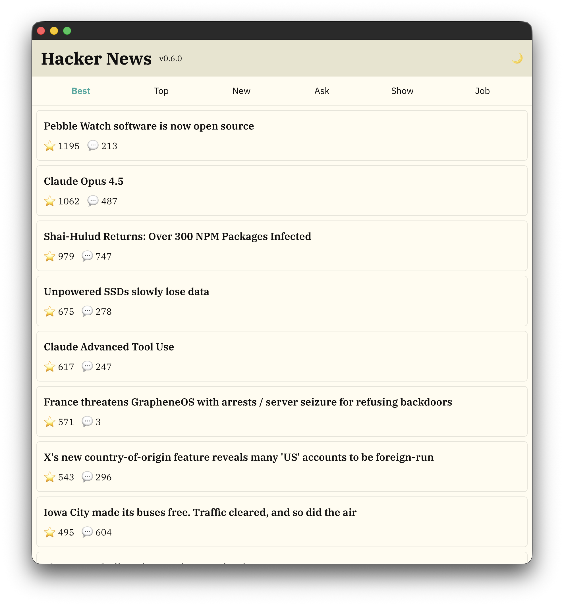
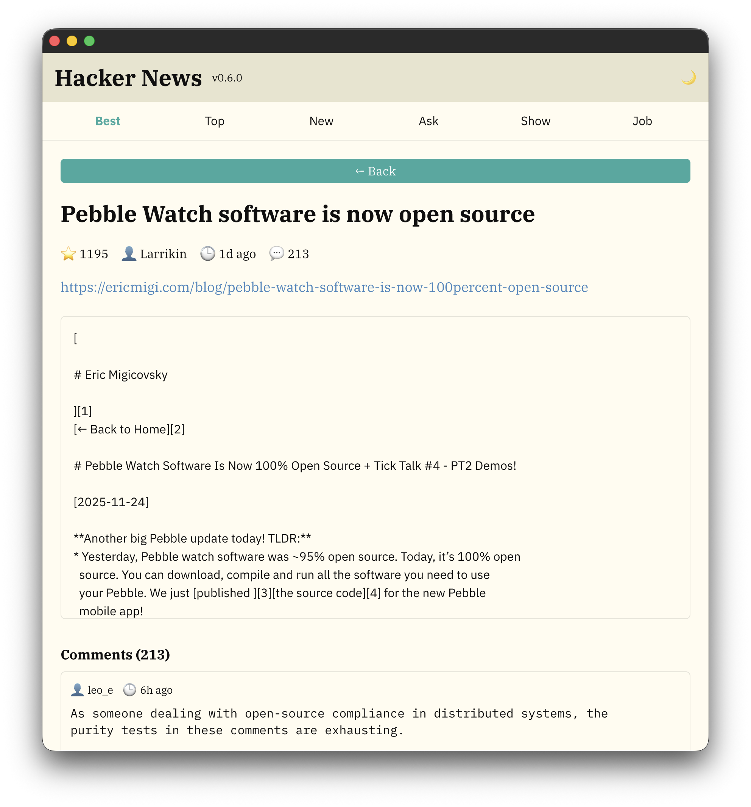
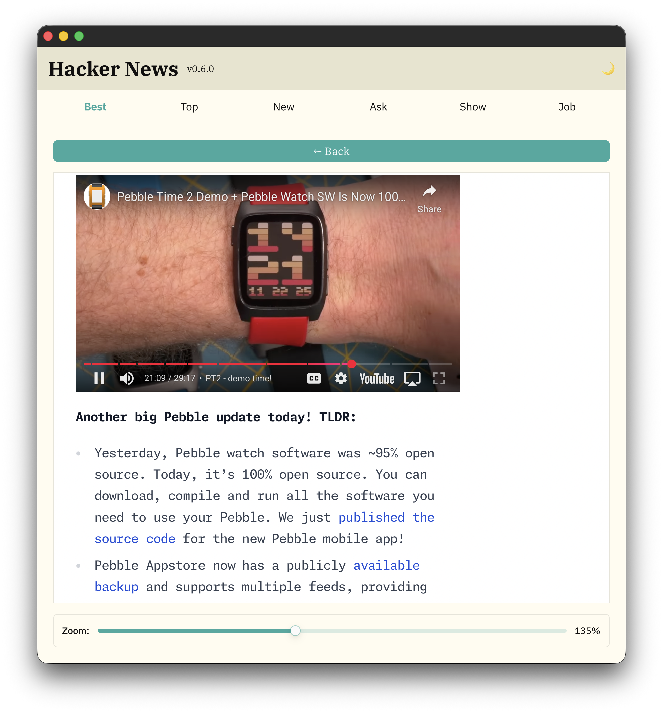
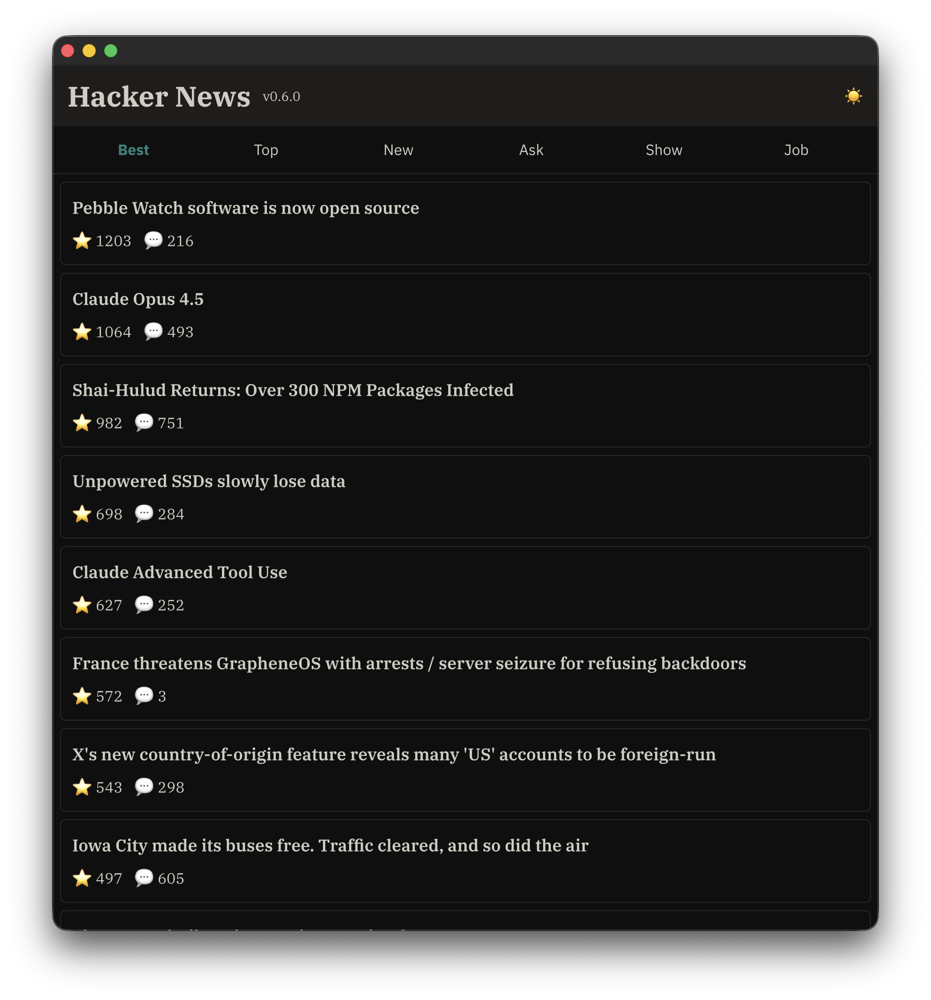
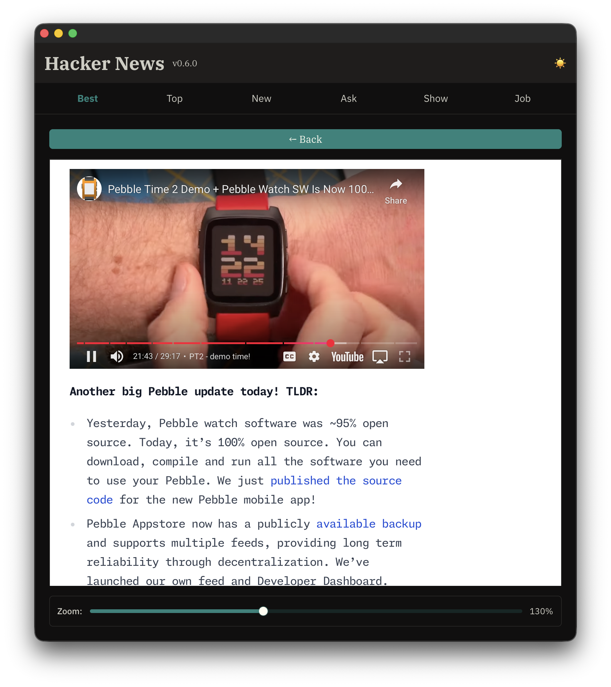
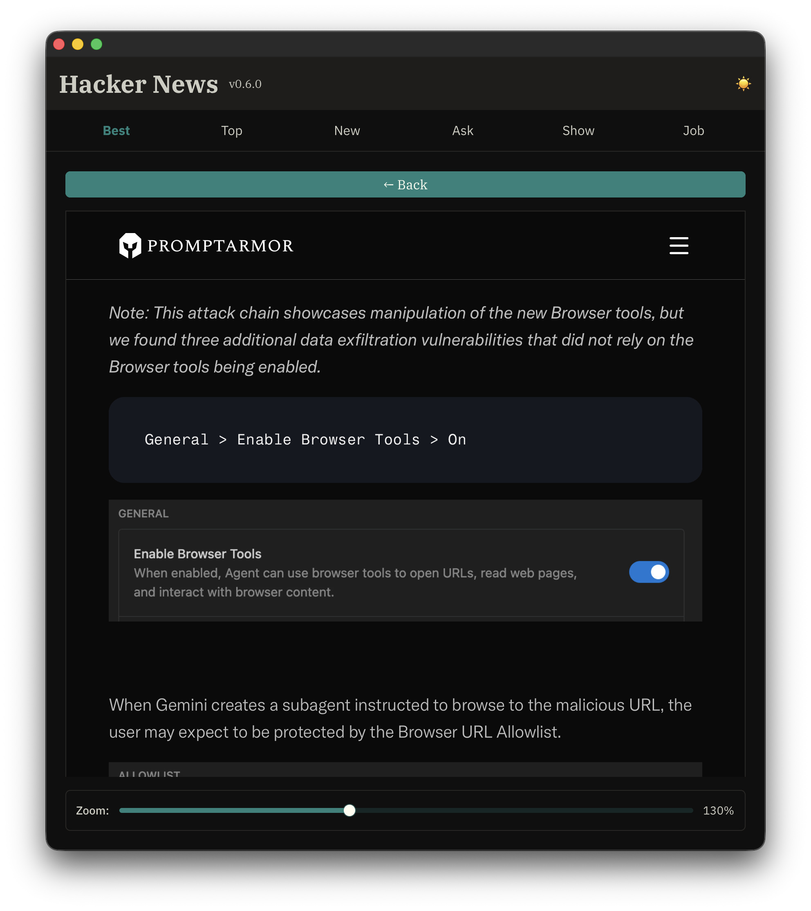

# GPUI Hacker News App

A Hacker News client built with [GPUI](https://www.gpui.rs/) and Rust, showcasing the use of separate GPUI components for building native desktop applications.

## Architecture

This application is built entirely with GPUI, Zed's GPU-accelerated UI framework, and utilizes modular component libraries:

- **[gpui-component](https://github.com/longbridge/gpui-component)** - Reusable UI components (buttons, sliders, webview)
- **Native performance** - GPU-accelerated rendering
- **Theming system** - Dynamic theme support with hot-reloading

### Project Structure

```
src/
├── api/              # Hacker News API service and types
├── config.rs         # Configuration loading and management
├── internal/         # Internal implementation modules
│   ├── events.rs     # Keyboard event handling and shortcuts
│   ├── layout.rs     # UI layout and rendering components
│   ├── markdown.rs   # Markdown rendering for story content
│   ├── models.rs     # Data models (Story, Comment)
│   ├── scroll.rs     # Scroll state management
│   └── webview.rs    # WebView initialization utilities
├── state/            # Application state management
│   └── mod.rs        # AppState with async story/comment fetching
├── utils/            # Utility functions
│   ├── datetime.rs   # Timestamp formatting
│   ├── html.rs       # HTML text extraction
│   └── theme.rs      # Theme color utilities
├── lib.rs            # Library entry point
└── main.rs           # Application entry point
```

The codebase follows a clear separation between public APIs (`api`, `config`, `state`) and internal implementation details (`internal/*`). The `internal` module encapsulates components that are implementation-specific and not part of the public API surface.

## Features

- Browse Hacker News stories (Best, Top, New, Ask, Show, Job)
- View story details with comments
- **Markdown rendering** for story content (bold, italic, links, code blocks)
- Embedded WebView for reading article content with adjustable zoom slider (50-250%)
- **Vi-style keyboard shortcuts** for navigation (j/k for scrolling, g for jump to top)
- Configurable fonts, WebView zoom, and window size
- Dark/Light theme support (Flexoki theme included)
- Responsive scrolling with infinite loading

## Screenshots

| List View | Detail View | Story View |
|-----------|-------------|------------|
|  |  |  |
| Browse stories from different categories | View story details with metadata and comments | Read article content in embedded webview with zoom control |

### Dark Theme

| Dark Theme 1 | Dark Theme 2 | Dark Theme 3 |
|--------------|--------------|--------------|
|  |  |  |
| Flexoki Dark theme (overview) | Detail view of Flexoki Dark | Alternate view of Flexoki Dark |

## Configuration

The app can be configured via a `config.ron` file. Place this file either:
- In the same directory as the executable, or
- In the current working directory

### Example config.ron

```ron
(
    // Font settings
    font_sans: "IBM Plex Sans",
    font_serif: "IBM Plex Serif",
    font_mono: "IBM Plex Mono",
    
    // Preferred theme name to use from ./themes
    theme_name: "Flexoki Light",
    
    // Path to a theme file or themes directory
    theme_file: "./themes",
    
    // WebView zoom level (percentage)
    // Default: 120 (120% zoom for better readability)
    // Adjust this value to make webview content larger or smaller
    // Examples: 100 (no zoom), 120 (20% larger), 150 (50% larger)
    webview_zoom: 130,
    
    // Window size (in pixels)
    // Default: 980x720
    window_width: 880.0,
    window_height: 920.0,
)
```

See [config.ron.example](config.ron.example) for a complete example.

### Configuration Options

- **font_sans**: Sans-serif font for UI elements (default: "IBM Plex Sans")
- **font_serif**: Serif font for article content (default: "IBM Plex Serif")
- **font_mono**: Monospace font for comments (default: "IBM Plex Mono")
- **theme_name**: Theme to apply (default: "Flexoki Light", also available: "Flexoki Dark")
- **theme_file**: Path to theme directory or file (default: "./themes")
- **webview_zoom**: WebView zoom percentage (default: 120)
  - `100` = No zoom (100%)
  - `120` = 20% larger (120%)
  - `150` = 50% larger (150%)
  - Adjustable via slider in webview (50-250%)
- **window_width**: Window width in pixels (default: 980.0)
- **window_height**: Window height in pixels (default: 720.0)

## Building & Running

```bash
# Development build
cargo run

# Release build (faster)
cargo run --release
```

## Usage

1. Launch the app
2. Browse stories by clicking on the tabs (Best, Top, New, Ask, Show, Job)
3. Click on a story to view details and comments
4. Click on a story URL to open it in the embedded WebView
5. Use the zoom slider at the bottom of the webview to adjust content size (50-250%)
6. Use the "← Back" button to return to the previous view
7. Toggle dark/light mode with the sun/moon icon in the header

### Keyboard Shortcuts

The app supports vi-style keyboard shortcuts for efficient navigation:

| Shortcut | Action |
|----------|--------|
| `j` | Scroll down (50px) |
| `k` | Scroll up (50px) |
| `g` | Jump to top |
| `Cmd+Q` (Mac) / `Ctrl+Q` (Windows/Linux) | Quit application |

**Notes:**
- Keyboard shortcuts work in both List view and Story detail view
- Scrolling shortcuts apply to the current view's content

## Components Used

This app demonstrates the integration of various GPUI components:

- **Button** - Navigation and actions
- **Slider** - Interactive zoom control
- **WebView** - Embedded browser for article viewing
- **Theme System** - Dynamic theming with JSON-based theme files
- **Custom Scrolling** - Smooth scrolling with infinite loading

## Customizing

### WebView Zoom

You can adjust zoom in two ways:
1. **Interactive slider**: Use the slider at the bottom of the webview (50-250%)
2. **Configuration file**: Set initial zoom in `config.ron`

### Themes

Place custom theme JSON files in the `./themes` directory. The app will watch for changes and hot-reload themes automatically.

The included Flexoki theme is from the [gpui-component repository](https://github.com/longbridge/gpui-component/blob/main/themes/flexoki.json).

Known limitations / TODOs

- The WebView theme injection feature (`webview_theme_injection`) is experimental and currently half-baked:
  - It attempts to apply the app's colors to arbitrary web content, which can break third-party page layouts or miss complex site backgrounds.
  - Unknown or complex site structures may not be themed correctly (margins, canvases, background images, or shadowed elements can remain unthemed).
  - Because this modifies external pages, it should be used cautiously.

Planned TODOs:
- Add a domain whitelist so injection only runs on trusted/internal pages instead of all sites.
- Improve selector scoping and background detection so we only inject when safe (detect non-transparent site roots, background images, or CSS variables).
- Provide a runtime UI toggle to enable/disable `webview_theme_injection` and persist the setting to `config.ron`.
- Add unit tests for the init-script generator and integration tests that validate injection behavior on known test pages.
- Offer a non-invasive theming mode that sets CSS variables (instead of forcing `!important` rules) so sites and the app can degrade gracefully.

Until these TODOs are implemented, treat `webview_theme_injection` as an experimental opt-in feature.
