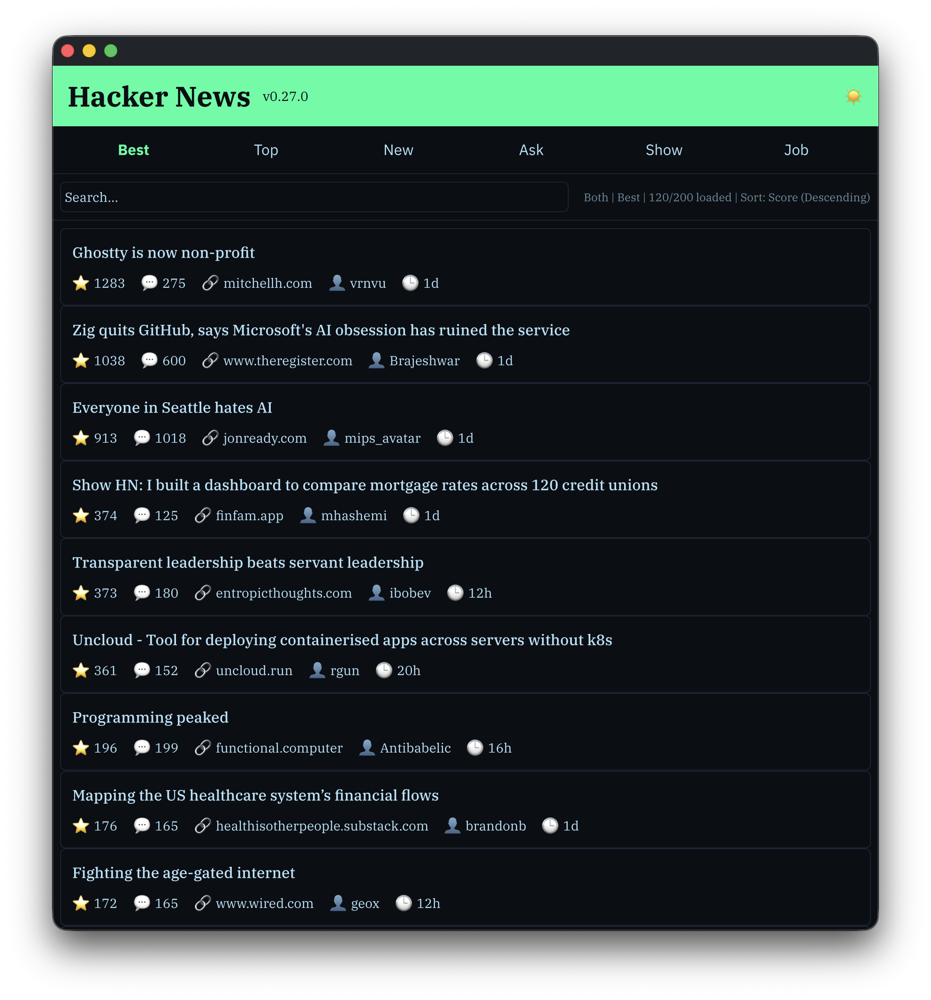
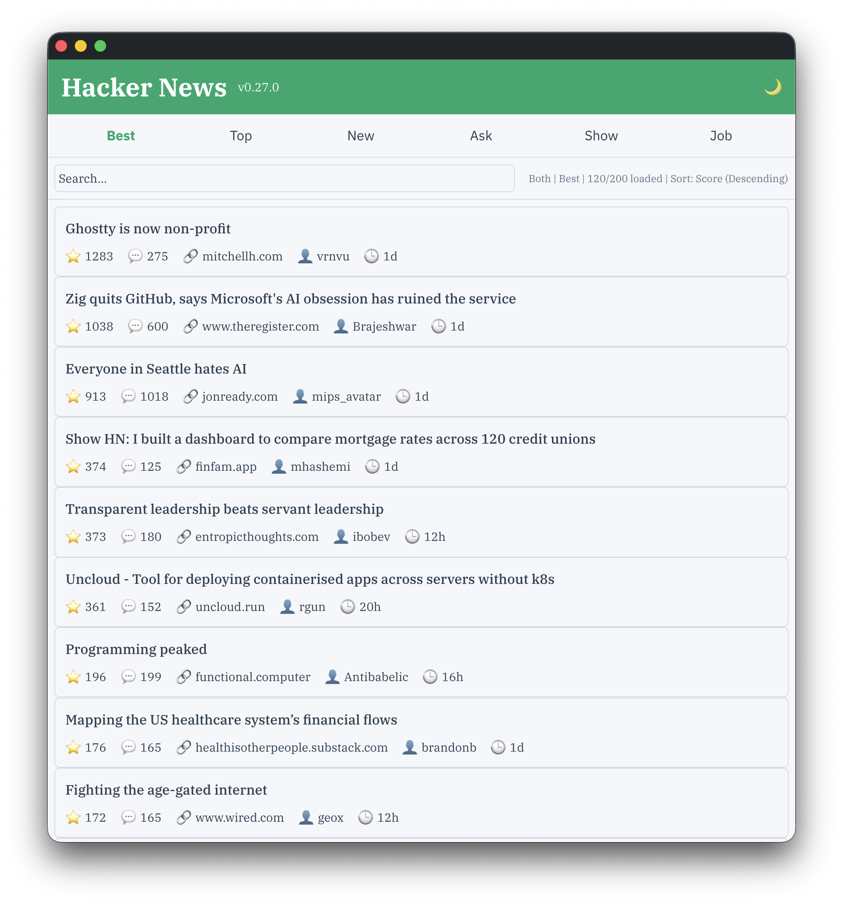
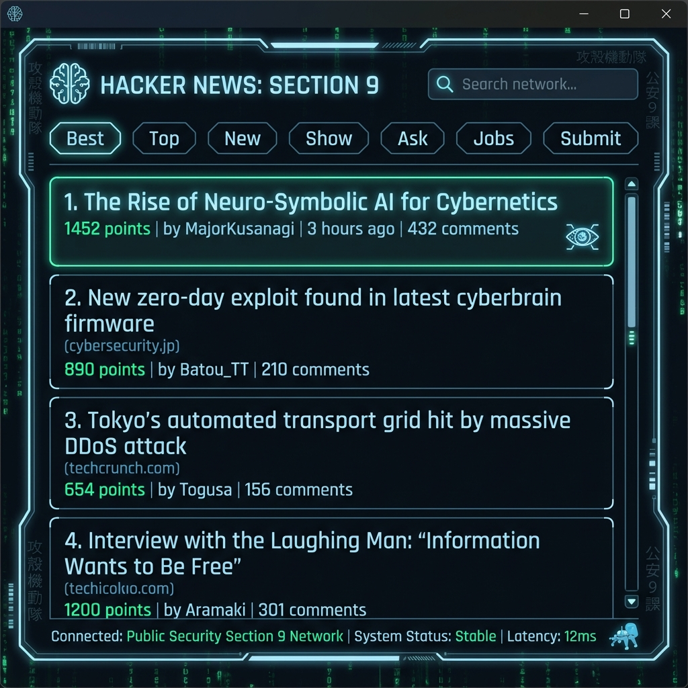

# GPUI Hacker News App

A Hacker News client built with [GPUI](https://www.gpui.rs/) and Rust, showcasing the use of separate GPUI components for building native desktop applications.

## Architecture

This application is built entirely with GPUI, Zed's GPU-accelerated UI framework, and utilizes modular component libraries:

- **[gpui-component](https://github.com/longbridge/gpui-component)** - Reusable UI components (buttons, sliders, webview)
- **Native performance** - GPU-accelerated rendering
- **Theming system** - Dynamic theme support with hot-reloading

### Project Structure

```
src/
├── api/              # Hacker News API service and types
├── config.rs         # Configuration loading and management
├── internal/         # Internal implementation modules
│   ├── ui            # smaller UI components for HnLayout
│   ├── events.rs     # Keyboard event handling and shortcuts
│   ├── layout.rs     # UI layout and rendering components
│   ├── markdown.rs   # Markdown rendering for story content
│   ├── models.rs     # Data models (Story, Comment)
│   ├── scroll.rs     # Scroll state management
│   └── webview.rs    # WebView initialization utilities
├── state/            # Application state management
│   └── mod.rs        # AppState with async story/comment fetching
├── utils/            # Utility functions
│   ├── datetime.rs   # Timestamp formatting
│   ├── html.rs       # HTML text extraction
│   └── theme.rs      # Theme color utilities
├── lib.rs            # Library entry point
└── main.rs           # Application entry point
```

The codebase follows a clear separation between public APIs (`api`, `config`, `state`) and internal implementation details (`src/internal/*`). The `internal` module encapsulates components that are implementation-specific and not part of the public API surface.

## Features

- Browse Hacker News stories (Best, Top, New, Ask, Show, Job)
- View story details with comments
- **Markdown rendering** for story content (bold, italic, links, code blocks)
- Embedded WebView for reading article content with adjustable zoom slider (50-250%)
- **Vi-style keyboard shortcuts** for navigation (`j`/`k` for scrolling, `g` for jump to top)
- Configurable fonts, WebView zoom, and window size
- Dark/Light theme support with **Theme Editor** (Save/Export custom themes)
- Responsive scrolling with infinite loading
- **Enhanced Search**: Regex support, search history, and multiple search modes (Title, Comments, Both)
- **Sorting**: Sort stories by Score, Comments, or Time (Ascending/Descending)

## Screenshots

| List View | Detail View | Story View |
|-----------|-------------|------------|
|  |  |  |
| Browse stories from different categories | View story details with metadata and comments | Read article content in embedded webview with zoom control |

### Dark Theme

| Dark Theme 1 | Dark Theme 2 | Dark Theme 3 |
|--------------|--------------|--------------|
|  |  |  |
| Flexoki Dark theme (overview) | Detail view of Flexoki Dark | Alternate view of Flexoki Dark |

Note: These screenshots were taken with version `v0.6.0`. Subsequent UI enhancements were made after that release, so the current app appearance may differ from the images shown here.

### Current Implementation

| Dark Theme (Updated) | Light Theme (Updated) |
|----------------------|-----------------------|
|  |  |
| Latest dark theme implementation | Latest light theme implementation |

### Ghost in the Shell Theme (Concept Preview)

> **Note**: The following images are **concept mockups** generated to visualize the intended aesthetic of the "Ghost in the Shell" theme. The actual implementation in the app applies these color palettes to the existing UI structure.

| Dark Mode (Concept) | Light Mode (Concept) |
|-----------|------------|
|  |  |
| Cyberpunk aesthetic with neon green accents | Clean, high-contrast light theme |

## Configuration

The app can be configured via a `config.ron` file. Place this file either:
- In the same directory as the executable, or
- In the current working directory

### Example configuration file

See the example configuration shipped with the project:
```gpui_hn_app/config.example.ron#L1-200
(
    // Example configuration for gpui-hn-app
    // Copy this to `config.ron` and edit values as needed.

    // Font settings - names must match installed system fonts (or fall back to defaults)
    font_sans: "IBM Plex Sans",
    font_serif: "IBM Plex Serif",
    font_mono: "IBM Plex Mono",

    // Preferred theme name to apply (must match a theme defined in your theme files)
    // Examples: "Flexoki Light", "Flexoki Dark"
    theme_name: "Flexoki Light",

    // Path to a theme file or themes directory.
    // If this points to a directory, the app will watch it for changes.
    // Example: "./themes" or "./themes/flexoki.json"
    theme_file: "./themes",

    // How the application should inject its UI theme into WebView content.
    // Accepts one of: "none", "light", "dark", "both"
    // - "none": never inject styles
    // - "light": inject only when the app is using a light theme
    // - "dark": inject only when the app is using a dark theme
    // - "both": inject for both light and dark themes (default)
    webview_theme_injection: "none",

    // How to apply theme injection: "invasive" or "css-vars"
    // - "invasive": uses !important to force theme colors (default, more aggressive)
    // - "css-vars": sets CSS variables without forcing (more respectful of site designs)
    webview_theme_mode: "invasive",

    // WebView zoom level as a percentage (e.g., 100 = normal, 120 = 20% larger)
    webview_zoom: 120,

    // Maximum run length before inserting soft-wrap characters.
    // Set to 0 to disable soft-wrapping entirely.
    soft_wrap_max_run: 20,

    // Window size in pixels (initial)
    window_width: 980.0,
    window_height: 720.0,
)
```

Note: copy `config.example.ron` to `config.ron` and edit values as needed.

### Configuration Options (updated)

- `font_sans`: Sans-serif font for UI elements (default: `"IBM Plex Sans"`)
- `font_serif`: Serif font for article content (default: `"IBM Plex Serif"`)
- `font_mono`: Monospace font for comments (default: `"IBM Plex Mono"`)
- `theme_name`: Theme to apply (default: `"Flexoki Light"`, also available: `"Flexoki Dark"`)
- `theme_file`: Path to theme directory or file (default: `"./themes"`)
- `webview_zoom`: WebView zoom percentage (default: `120`)
  - `100` = No zoom (100%)
  - `120` = 20% larger (120%)
  - `150` = 50% larger (150%)
  - Adjustable via slider in webview (50-250%)
- `webview_theme_injection`: How/when to inject app theme CSS into pages rendered in the WebView (values: `"none"`, `"light"`, `"dark"`, `"both"`) — set to `"none"` to disable injection.
- `webview_theme_mode`: Injection method for theme styles (`"invasive"` or `"css-vars"`) — `"invasive"` uses `!important` to force styles, `"css-vars"` sets CSS variables for a less aggressive approach.
- `soft_wrap_max_run`: Maximum run length before inserting soft-wrap characters to prevent overflow in markdown rendering. Set to `0` to disable soft-wrapping (default: `20`).
- `window_width`: Window width in pixels (default: `980.0`)
- `window_height`: Window height in pixels (default: `720.0`)
- `keybindings`: Map of key combinations to actions (e.g., `"ctrl+j": "ScrollDown"`). See `src/config.rs` for available actions.
- `ui`: UI customization settings:
  - `padding`: Window padding (default: `16.0`)
  - `status_bar_format`: Format string for status bar. Available placeholders: `{mode}`, `{category}`, `{loaded}`, `{total}`, `{count}`, `{sort}`, `{order}` (default: `"{mode} | {category} | {loaded}/{total} loaded"`)
  - `list_view_items`: List of fields to show in story list (default: `["score", "comments", "domain", "author", "age"]`)
- `network`: Network configuration settings:
  - `max_retries`: Maximum number of retry attempts for failed requests (default: `3`)
  - `initial_retry_delay_ms`: Initial delay before first retry in milliseconds (default: `1000`)
  - `max_retry_delay_ms`: Maximum delay between retries in milliseconds (default: `30000`)
- `log`: Logging configuration settings:
  - `log_level`: Default log level (default: `"info"`, options: `"trace"`, `"debug"`, `"info"`, `"warn"`, `"error"`)
  - `log_dir`: Directory for log files (default: `"./logs"`)
  - `module_filters`: Module-specific log levels (e.g., `{"gpui_hn_app::api": "debug"}`)
  - `enable_performance_metrics`: Enable performance metrics logging (default: `false`)
- `accessibility`: Accessibility settings:
  - `high_contrast_mode`: Enable high contrast theme (default: `false`)
  - `verbose_status`: Enable descriptive status messages (default: `false`)


## Internal UI components

A few internal UI components were extracted and live under `src/internal/ui/`. These are implementation details intended to keep the layout code tidy and reusable.

- `src/internal/ui/header.rs`
  - Exposes `render_header(...)` which builds the app header and tabs bar.
  - The theme toggle in the header uses `gpui_component::ThemeRegistry` + `Theme::global_mut(...)` to switch between configured themes. The toggle computes the desired theme name using `crate::utils::theme::toggle_dark_light` and applies it if the theme exists in the registry.
- `src/internal/ui/story_list.rs`
  - Implements `StoryListView` which renders the stories with a custom `ScrollState` and supports infinite loading when you scroll near the bottom.
  - Keyboard and mouse scrolling are handled by the view and mapped into the `ScrollState`.
- `src/internal/ui/story_detail.rs`
  - Implements `StoryDetailView` which renders story metadata, the rendered markdown content, and the comments list.
  - Markdown rendering uses a pre-processing step (`soft_wrap`) guided by `soft_wrap_max_run` from the configuration to avoid layout overflow from long runs.
  - Comments are rendered with a monospaced font and include incremental "Load More Comments" behavior when more comment IDs remain.
- `src/internal/ui/webview_controls.rs`
  - Exposes `render_webview_controls(...)`, a small, reusable control row used when the WebView is visible.
  - The controls include a `Slider` backed by a `SliderState` for zoom, a numeric zoom label, and a Theme Injection toggle. The toggle cycles through the injection modes and updates `AppState` via `AppState::set_theme_injection(...)`.

These internal modules are intentionally slim wrappers around `gpui` and `gpui_component` widgets to keep the layout code modular and testable.

## Building & Running

Follow the TDD-friendly workflow described in `AGENTS.md` if you're contributing. For local runs:

```bash
# Development build
cargo run

# Release build (faster)
cargo run --release
```

Recommended helper tasks (see `Taskfile.yml` in the project root):
- `task fmt` — run `cargo fmt`
- `task clippy` — run `cargo clippy`
- `task build` — runs `fmt`, `clippy`, then `cargo build --release`
- `task run` / `task run:debug` — run the app

## Usage

1. Launch the app
2. Browse stories by clicking on the tabs (Best, Top, New, Ask, Show, Job)
3. Click on a story to view details and comments
4. Click on a story URL to open it in the embedded WebView
5. Use the zoom slider at the bottom of the webview to adjust content size (50-250%)
6. Use the "← Back" button to return to the previous view
7. Toggle dark/light mode with the sun/moon icon in the header

### Keyboard Shortcuts

| Key | Action |
|-----|--------|
| `j` / `k` | Navigate stories down/up |
| `g` | Scroll to top |
| `Enter` | Open story details / comments |
| `b` | Toggle bookmark |
| `B` | View bookmarks |
| `H` | View history |
| `X` | Clear history (in history view) |
| `t` | Open theme editor (Save/Export available) |
| `L` | Open log viewer (debug logs with syntax highlighting) |
| `Esc` | Go back / Close webview |
| `Cmd+Q` (Mac) / `Ctrl+Q` (Windows/Linux) | Quit application |
| `Ctrl+R` | Focus search bar (supports Regex) |
| `Ctrl+M` | Cycle search mode (Title/Comments/Both) |
| `Ctrl+S` | Cycle sort option (Score/Comments/Time) |
| `O` | Toggle sort order (Asc/Desc) |
| `?` | Show keyboard shortcuts help |
| `Up` / `Down` | Navigate search history (in search bar) |

Notes:
- Keyboard shortcuts work in both List view and Story detail view
- Scrolling shortcuts apply to the current view's content

## Components Used

This app demonstrates the integration of several GPUI components:

- `Button` - Navigation and actions
- `Slider` - Interactive zoom control
- `WebView` - Embedded browser for article viewing
- Theme System - Dynamic theming with JSON-based theme files
- Custom Scrolling - Smooth scrolling with infinite loading

## Customizing

### WebView Zoom

You can adjust zoom in two ways:
1. Interactive slider: Use the slider at the bottom of the webview (50-250%)
2. Configuration file: Set initial zoom in `config.ron`

### Theme Injection into WebView

Control how the app attempts to apply its theme into the WebView content via `webview_theme_injection`:
- `none` — do not inject any theme styles
- `light` — inject styles only when the app is in a light theme
- `dark` — inject styles only when the app is in a dark theme
- `both` — inject styles for both light and dark themes

Choose `webview_theme_mode` to control how injection is applied:
- `invasive` — force styles via `!important` (more aggressive, higher chance of overriding site styles)
- `css-vars` — set CSS variables to make theme colors available to the page without forcing them

### Themes

Place custom theme JSON files in the `./themes` directory. The app will watch for changes and hot-reload themes automatically.

The included Flexoki theme is from the `gpui-component` repository: `https://github.com/longbridge/gpui-component/blob/main/themes/flexoki.json`.

## Contributing & TDD notes

This repository follows a TDD-first workflow and tidy-first refactoring rules. Please refer to `AGENTS.md` for the development principles and the recommended `task` commands to keep formatting and linting consistent.

If you're adding UI behavior, prefer:
1. A small failing unit test (Red)
2. Minimal implementation to make it pass (Green)
3. Refactor for clarity without changing behavior (Tidy First)

Happy hacking!
